Привет, меня зовут **Алина** 👋

Завершаю учебу на курсе  

**Fullstack разработчик на Python**
 

Блок **ДИПЛОМНАЯ РАБОТА**
#  Силант


[](https://git.io/typing-svg)
___


**Задание:**

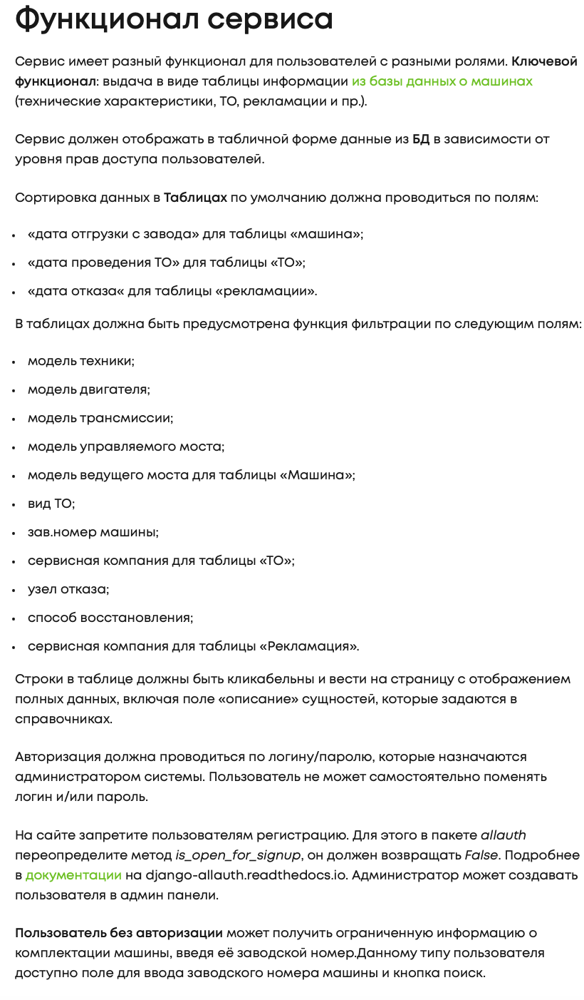
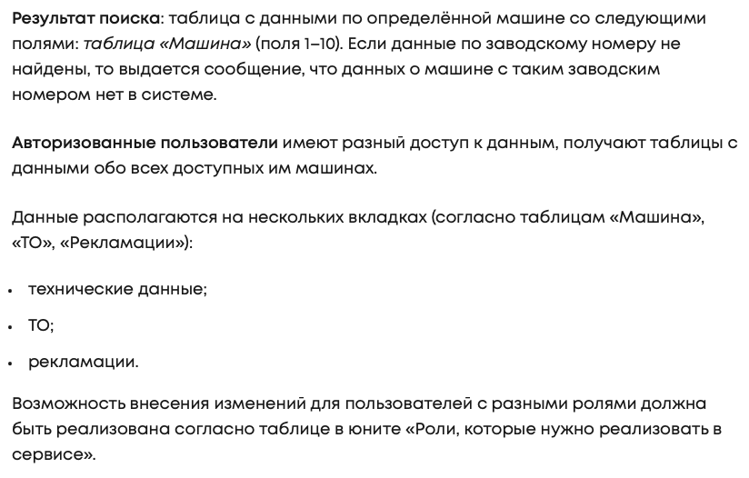
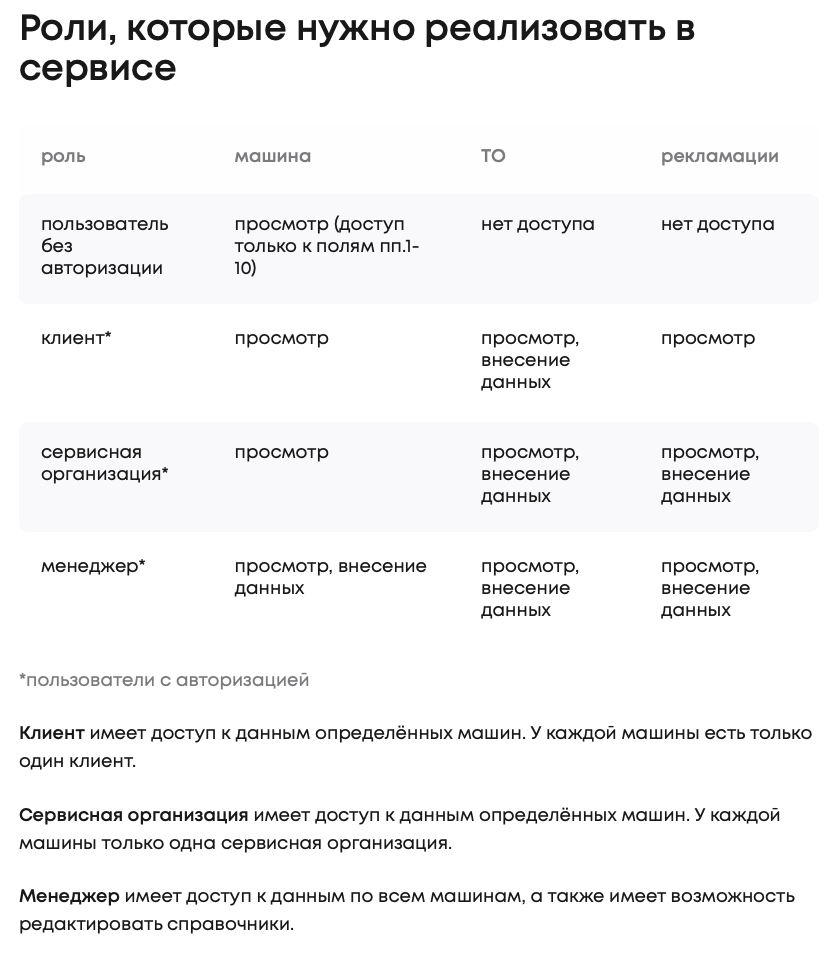
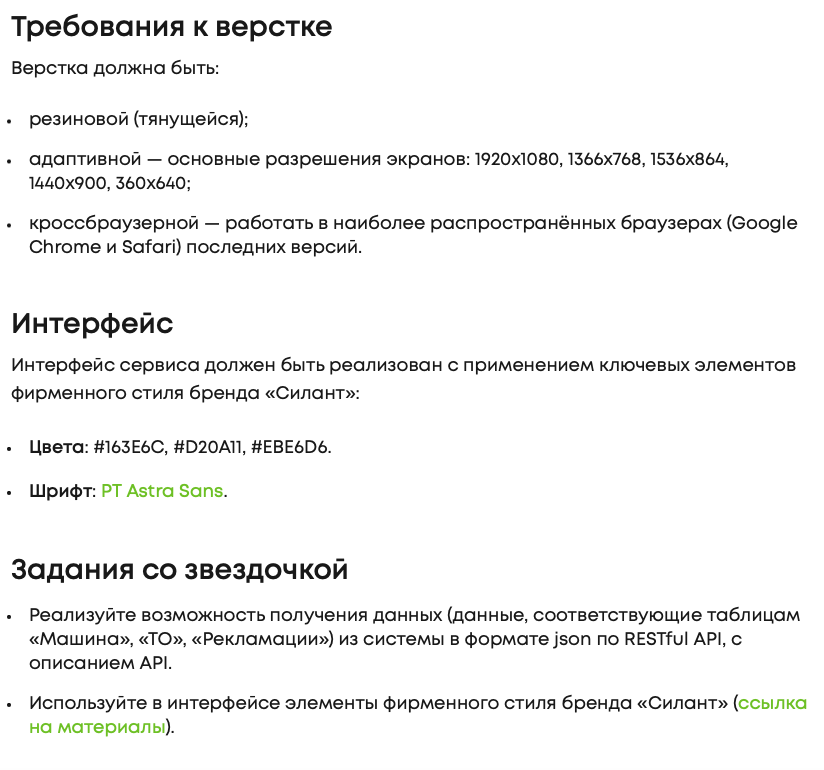

**Проект:**


### **Быстрый старт:**
**Для запуска проекта необходимо:**

1. Клонировать репозиторий 

    ➡️  [Github repository](https://github.com/Nimalia/FINAL-SF-Silant.git)

2. Установить виртуальное окружение
    ```bash 
    python3 -m venv venv
    ```

    ```bash 
    source ./venv/bin/activate
    ```
3. Установить `requirements.txt`
    ```bash 
    pip install -r requirements.txt
    ```
4. Переходим в директорию (если необходимо):
    ```bash 
    cd *имя директории* 
    ```
5. Создать пользователя
    ```bash 
    python3 manage.py createsuperuser
    ```
6. Запустить сервер
    ```bash 
    python3 manage.py runserver
    ```

7. Запускаем [Силант](127.0.0.1:8000/search/) 
 
    ⚠️ порт 8000
 
### **Роли:**

Клиент: Trudnikov 

Пароль: Client2023
___

Менеджер: manager1

Пароль: manager
___

Сервисная компания: FNS

Пароль: Client2023
____

### **Структура приложения:**

1. Вход неавторизованного пользователя:
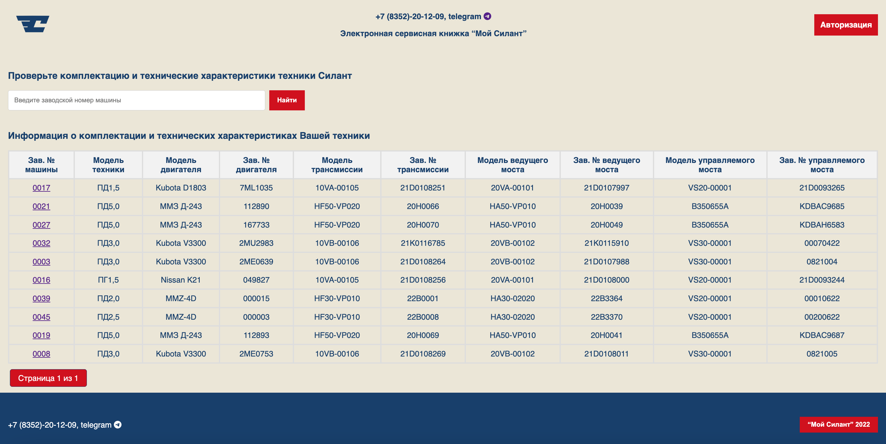

Пользователь видит только список техники
и может совершить поиск:
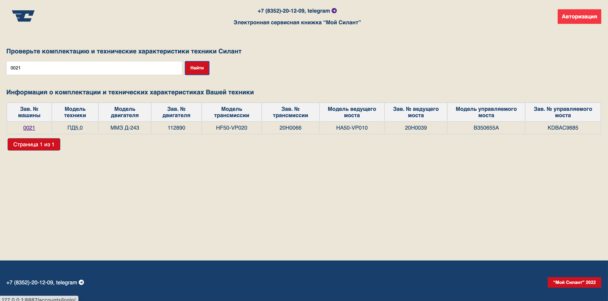

2. Зарегистрировать пользователя может только Администратор. 
Администратору доступен весь функционал приложения: 
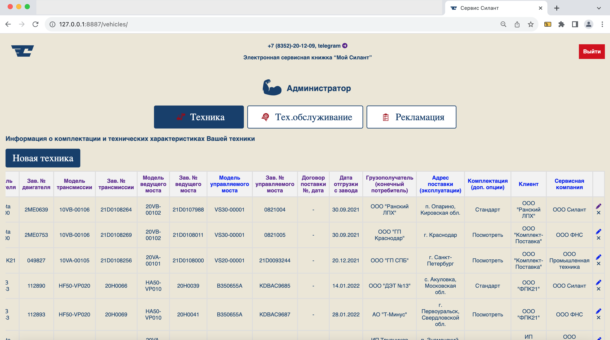

3. Сделаны отдельные группы с правами:
- группа для менеджеров Силант, которым выданы определенные права
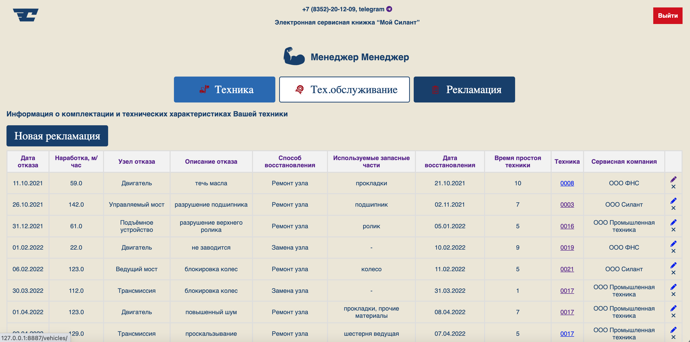  

- группа клиентов Силант, которым выданы определенные права
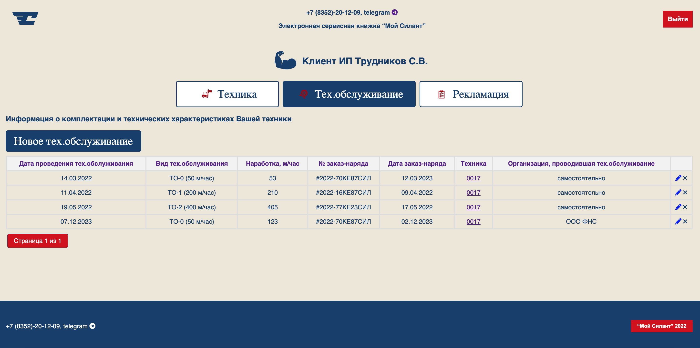  

- группа для сервисных компаний Силант, которым выданы определенные права
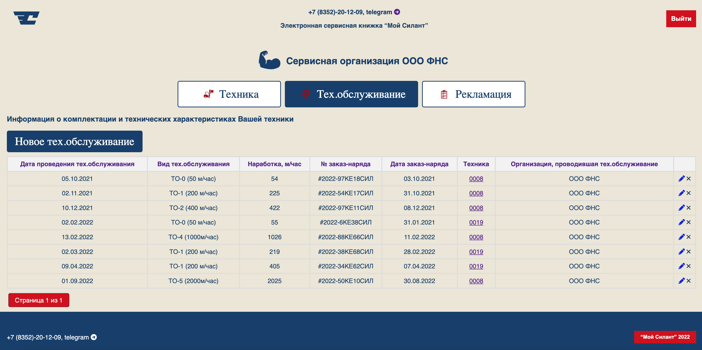  

4. Детализация по каждой технике:
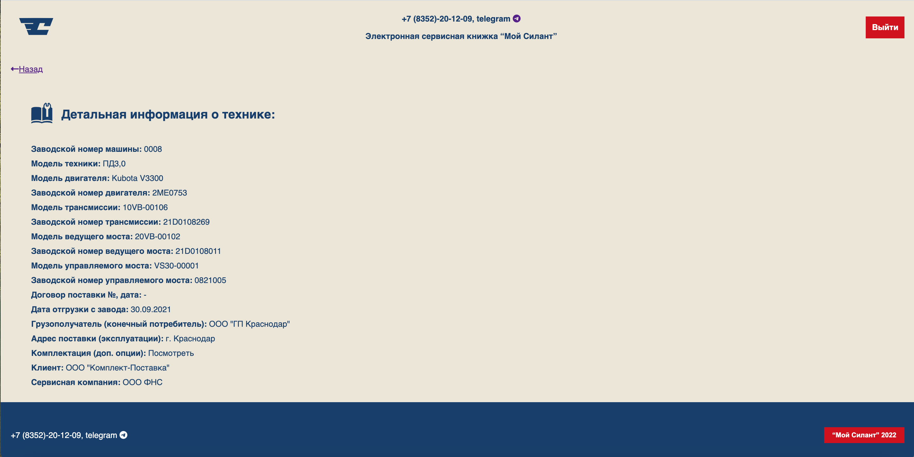 

5. Создание Новой техники/Нового тех.обслуживания/Новой рекламации (в зависимости от роли):
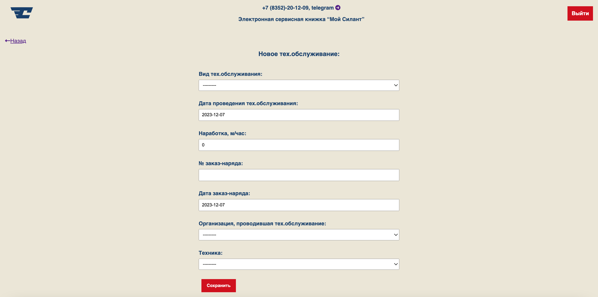

6. Страница авторизации:
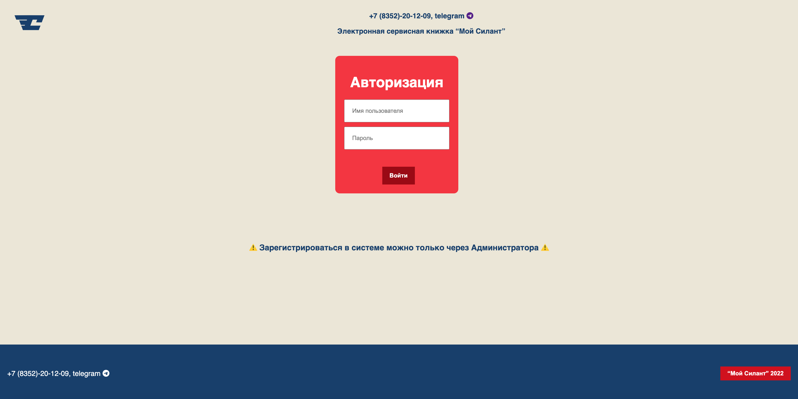  

7. Страница выход:
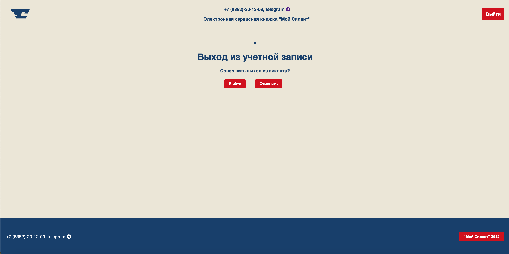 

8. Модальные окна:
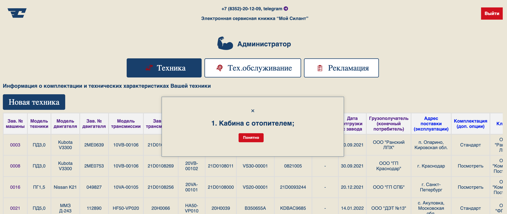 

9. Адаптивность верстки:
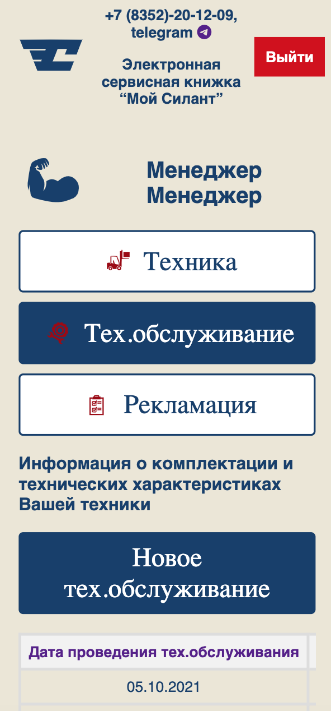 

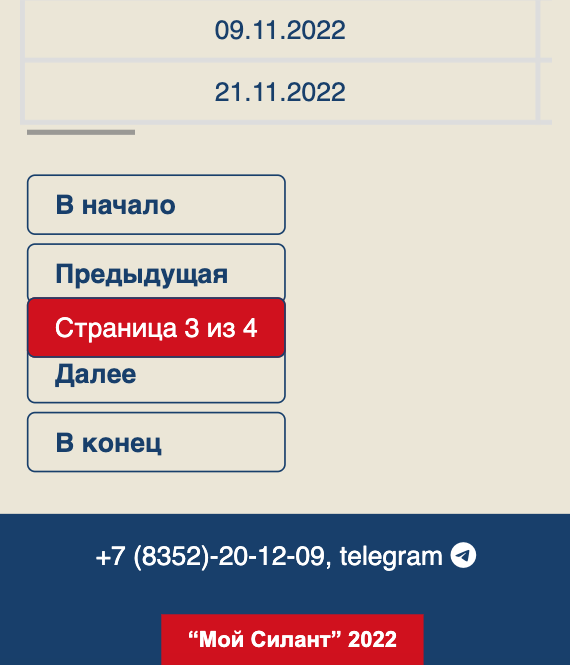 

**🛠️Технические нюансы🔩**

1. Импорт данных из Exel в SQL производиться с помощью 
```bash
Django import/expot
```
так как поля в моделях 
```bash
= ForeignKey
```
то необходимо использовать [widget](https://django-import-export.readthedocs.io/en/latest/advanced_usage.html#importing-model-relations)


2. Для иконок [онлайн конвертор](https://convertio.co/ru/png-svg/)

3. Сортировка через ```ordering``` во ```views.py```

4. Пагинация через ```views.py``` + ```шаблон html``` + ```css```
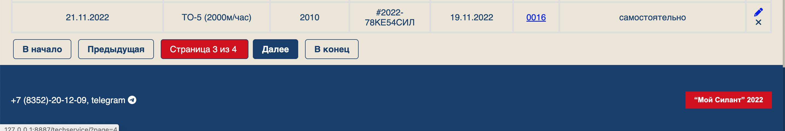


----
```` Спасибо за уделенное время! 🙏 ````

___


[](https://github.com/anuraghazra/github-readme-stats)